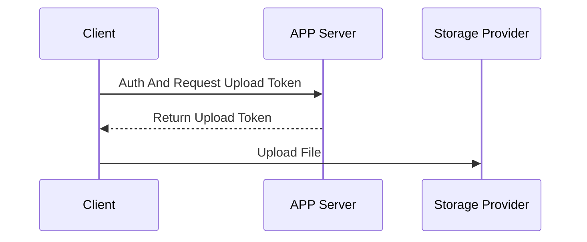

### Overall

使用第三方Storage Provider（例如七牛云，腾讯云，阿里云，AWS等）应该遵循以下编程模型：

1） 使用方永远不要将密钥存放在Client端中。

2）当使用方需要给客户端上传权限时，需要实现业务服务器（App Server）对Client端鉴权，App Server端存放Storage Provider的密钥信息。

3）使用密钥信息，生成上传/下载Token信息，Token应该有时效性，例如1小时过期。

4）将Token返回给Client，Client使用Token与Storage Provider通信。

### Upload Sample：

