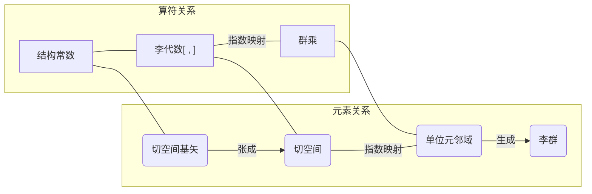

```mermaid
graph LR

X---A
Y---B
Z---C

  subgraph 元素关系
  A(切空间基矢) -->|张成| B(切空间)
    B ---|指数映射| C(单位元邻域)
    C -->|生成| D(李群)
    end
    
  subgraph 算符关系
  X[结构常数] --- Y["李代数[ , ]"]
    Y ---|指数映射| Z[群乘]
    end
```
